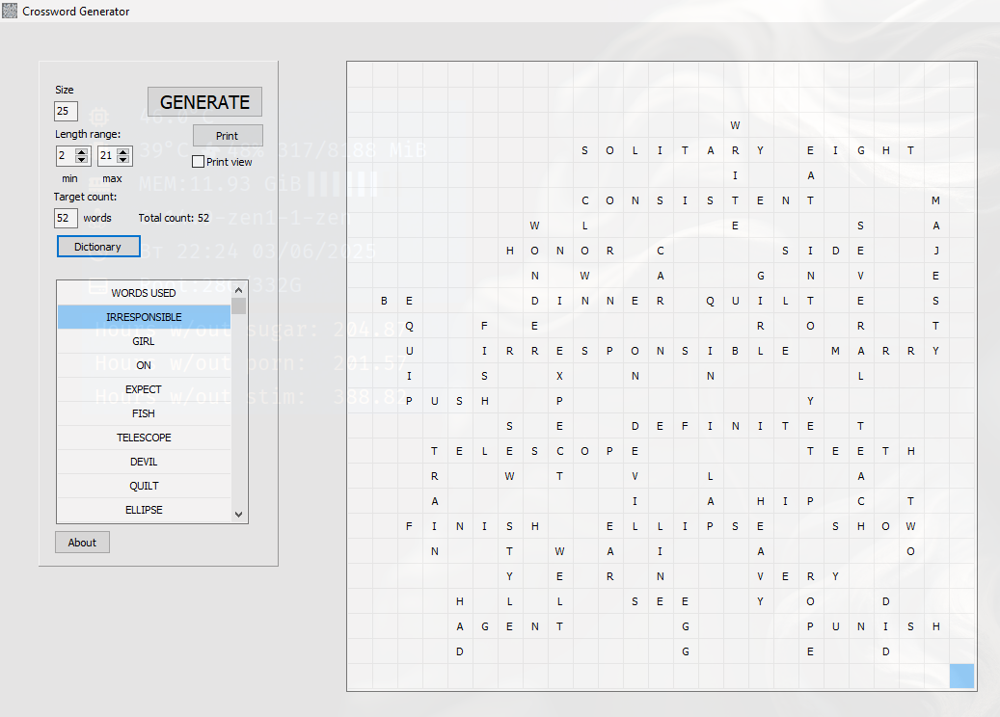
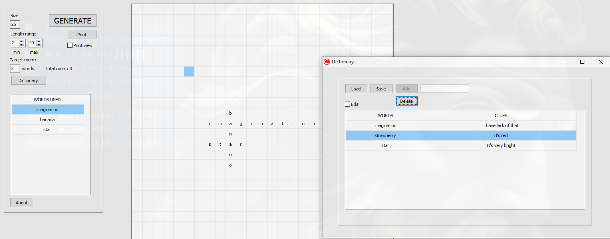
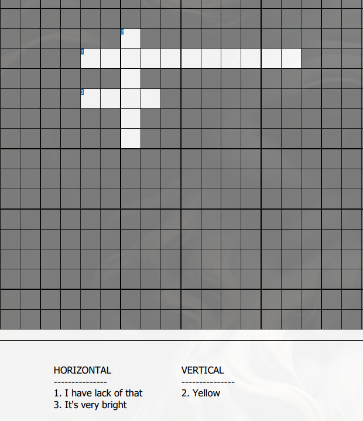

# Project: Crossword Generator
- This project was made using Embarcadero C++ Builder. Its UI was made with C++ VCL framework (Visual Component Library).
- It is designed to load .txt dictionaries like *{word=clue}* and place it on a grid according to crossword game rules.
- Users can print the result or save it in .pdf, the words will be shadowed, of course.

## This directory contains precompiled .exe binary for Windows OS

# Проект: Генератор Кроссвордов
- Этот проект был выполнен в Embarcadero C++ Builder. Пользовательский интерфейс сделан при помощи C++ фреймворка VCL (Библиотека Визуальных Компонентов).
- Программа загружает словари в .txt, состоящие из слов и их значений вида *{word=clue}*, и помещает на сетку по правилам игры в кроссворд
- Пользователи могут распечатать результат или сохранить в .pdf, слова при этом будут скрыты, конечно.

## Эта директория содержит скомпилированный бинарный файл .exe для ОС Windows

