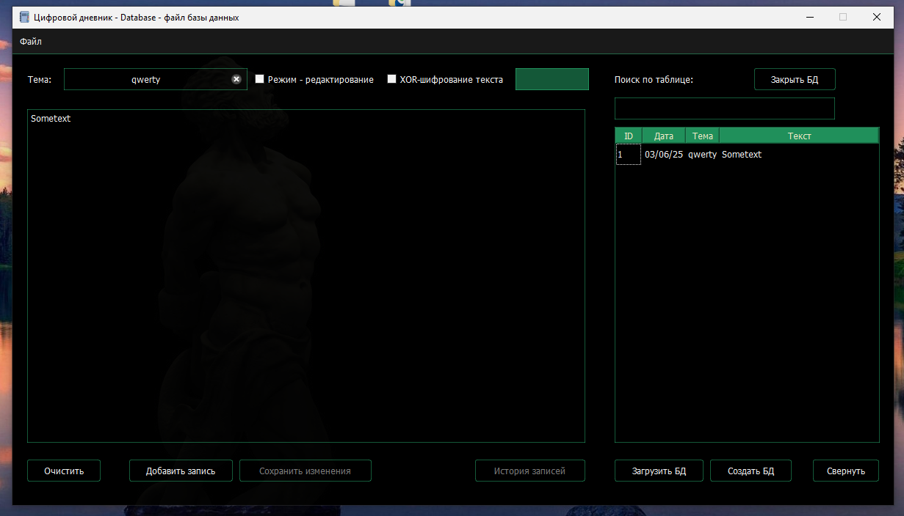

# Project: Diary
- It is a diary you may use to store your notes etc.
- The diary stores data in sqlite db and supports XOR as the simplest way for private use.
- The project is written in Python. Its UI is made with PyQt5 framework.
- Users are able to either load/save their notes in .txt or export it in pdf

## This directory contains source files, prebuilt app and automated installer for Windows OS   

-----------------

# Проект: Дневник
- Это дневник, который вы можете использовать для хранения своих заметок и т.д.
- Дневник хранит данные в базе данных sqlite и поддерживает XOR как простейший способ обеспечения приватности.
- Проект написан на Python. Его пользовательский интерфейс создан с использованием фреймворка PyQt5.
- Пользователи могут сохранять/загружать свои заметки в формате .txt, или экспортировать их в .pdf 

## Этот каталог содержит исходные файлы, готовое приложение и автоматизированный установщик для ОС Windows

