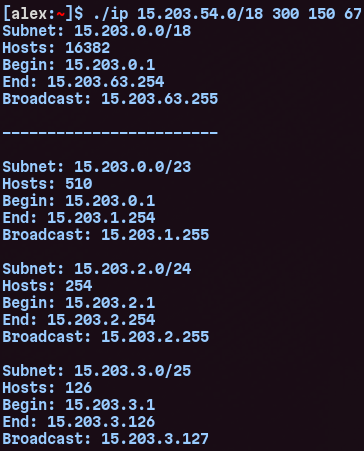

# Project: IPv4 Subnet Calculator
- This small program was made for convenient managing IP addresses.
- I didn't use any additional libraries for this to work, though it wasn't so difficult.

## Usage
```console
./ip aaa.aaa.aaa.aaa/mm [ subnet1 subnet2 ... ]
```
## Example

