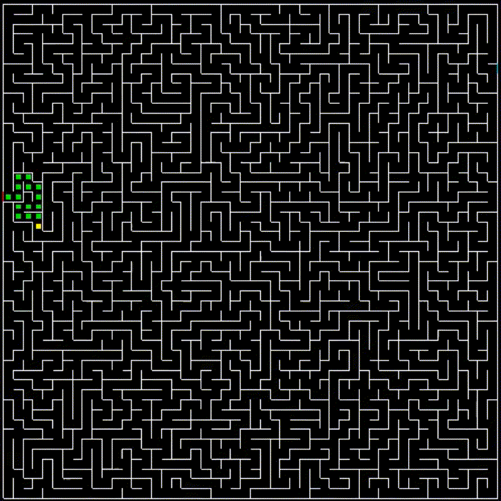

# Project: Maze Generator & Solver
- This program generates a random maze and starts solving it immediately
- It is made to demonstrate my ability to work with SFML, C++ STD and basic understanding of algorithms and data structures

## This directory contains binary compiled for x86-64 Linux and source .cpp file, so you can build it yourself

## Dependencies

	sfml>=3.0.0, g++

## Compile

```bash
g++ main.cpp -o maze -lsfml-graphics -lsfml-window -lsfml-system
``` 

